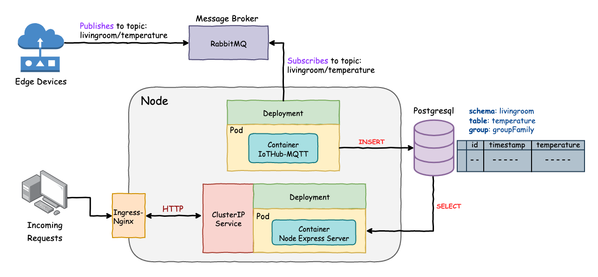
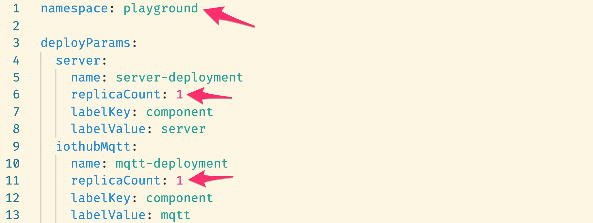

# mqtt-postgres-k8s

This sample code shows how to deploy an application to the **EnSaaS 4.0** environment and connect to the the database (Postgresql) and message broker (RabbitMQ) services provided by the platform.

- Container Orchestration: **Kubernetes**
- Package Manager: **Helm**

<br>

## Table of Contents

- [Application Architecture](#Application-Architecture)
- [Ingress Layout](#Ingress-Layout)
- [Quick Start](#Quick-Start)
  - [Downloading the Project](#1-Downloading-the-Project)
  - [Installing a Release](#2-Installing-a-Release)
  - [Retrieving the URL of the Application](#3-Retrieving-the-URL-of-the-Application)
- [Customizing the Application](#Customizing-the-Application)
  - [Building & Pushing the Images](#1-Building--Pushing-the-Images)
  - [Configuring the Helm Chart](#2-Configuring-the-Helm-Chart)
  - [Installing a Release](#3-Installing-a-Release)
- [Upgrade & Rollback](#Upgrade--Rollback)

## Application Architecture



<br>

## Ingress Layout


<br>

## Quick Start

### 1. Downloading the Project

```sh
$ git clone git@github.com:WISE-PaaS/mqtt-postgres-k8s.git
$ cd mqtt-postgres-k8s/helm-chart
```

### 2. Installing a Release

First, make sure you are working in the EnSaaS 4.0 environment.

```sh
$ kubectl config get-contexts
```

Switch to the correct environment if you are not currently in the EnSaaS environment.

```sh
$ kubectl config use-context [CONTEXT]
```

Install the applicaiton to the platform.

```sh
$ helm install demo .
```

Show the list of installed applications.

```sh
$ helm ls
```

Now, you have completed the deployment, and your app is good to go!

### 3. Retrieving the URL of the Application

```sh
$ kubectl get ingress
```

In the output, you can find the hostname of the application.


The naming convention for the ``HOSTS`` while you are deploying the app to EnSaaS. You can set up these required valus in your Helm Chart.

``{Host}.{Namespace}.{ClusterName}.internal``

From the ``HOSTS``, you can get the external URL with the following format:

``https://{Host}-{Namespace}-{ClusterName}.es.wise-paas.cn``

In this example, we can access the application by going to:

``https://iothome-playground-slave04.es.wise-paas.cn``

<br>

## Customizing the Application

### 1. Building & Pushing the Images

```sh
$ cd server/
$ docker build {DockerHubAccount}/{ImageName}:{Tag} .
$ docker push {DockerHubAccount}/{ImageName}:{Tag}

$ cd ../iothub-mqtt/
$ docker build {DockerHubAccount}/{ImageName}:{Tag} .
$ docker push {DockerHubAccount}/{ImageName}:{Tag}
```

<br>

### 2. Configuring the Helm Chart

```sh
$ cd ../helm-chart/
```

Inside ``Chart.yaml``, customize your **Chart Name** and Versions.


The **Chart Name** and **Chart Version** will be displayed in the ``helm list`` as soon as you install a release.

<br>

Inside ``Values.yaml``, you can tune the following options:

- **namespace**

  Set this value according to the namespace that has been created in your workspace.

- **replicaCount**

  Increase this value to scale out the application.

  

<br>

- **repository**

  Your DockerHub account

- **imageNmae** & **tag**

  Change these values if you have built your own images.

- **resources**

  Fine-tune resource usage according to your need.

  

<br>

- **cluster**

  Name of the cluster that you are currently working in.

- **host**

  You may also change this value so that your URL can be more customized.

  

<br>

### 3. Installing a Release

As mentioned in the first section, install the release using helm install once you have finished your customized.

```sh
# Under helm-chart directory
$ helm install {ReleaseName} .
```

<br>

## Upgrade & Rollback

One way to upgrade your release is to set up all the values that you want change in a file and then apply this file using the following command.

```sh
$ helm upgrade [RELEASE] [CHART] -f [YAML_FILE]
```

We can use the example file that has been included in this repository as a demonstration.

```sh
$ helm upgrade demo . -f newvalue.yaml
```

Inside ``newvalue.yaml``:

```yaml
deployParams:
  iothubMqtt:
    replicaCount: 2
```

This upgrade will **scale out** the application by adding another **Pod** that runs the ``mqtt`` container.


Now, we can check what velues have been changed.

```sh
$ helm get values demo
USER-SUPPLIED VALUES:
deployParams:
  iothubMqtt:
    replicaCount: 2
```

<br>

You can also rollback the **Release** to the previous **Revision** using the following command.

Let's check the revision history first.

```sh
$ helm history demo
REVISION	UPDATED                 	STATUS    	CHART             	APP VERSION	DESCRIPTION
1       	Wed Feb 19 12:22:56 2020	superseded	iot-home-k8s-0.3.0	1.0.0      	Install complete
2       	Wed Feb 19 13:34:45 2020	superseded	iot-home-k8s-0.3.1	1.0.0      	Upgrade complete
3       	Wed Feb 19 15:21:20 2020	deployed  	iot-home-k8s-0.3.2	1.0.0      	Upgrade complete
```

Roll back to the revision No. 2.

```sh
$ helm rollback demo 2
Rollback was a success! Happy Helming!
```

Now, check the deployment again and we can see that the application has been scaled in by rolling back to the previous status.


