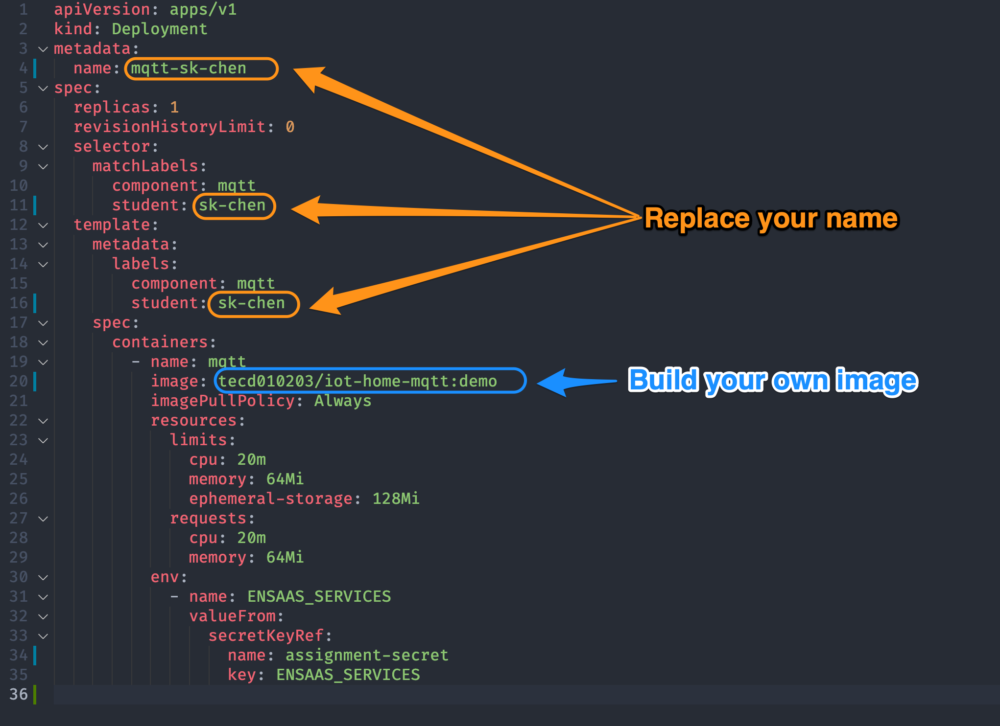

# Iot-Project

# 1. Before You Start

## Understanding PostgreSQL *GROUP* on Local DB

- Create a local **server** named *demo-db* **→** **hostname: localhost**
- Create a new **group →** *groupTest*
- Open **Query Tool** on *postgres* db
- Paste the following query string into the query tool window and **run**

```sql
CREATE SCHEMA IF NOT EXISTS "testSchema";
ALTER SCHEMA "testSchema" OWNER TO "groupTest";
CREATE TABLE IF NOT EXISTS "testSchema"."testTable"(
     id integer,
     name character(50)
);
ALTER TABLE "testSchema"."testTable" OWNER to "groupTest";
GRANT ALL ON ALL TABLES IN SCHEMA "testSchema" TO "groupTest";
GRANT ALL ON ALL SEQUENCES IN SCHEMA "testSchema" TO "groupTest";
```

- Inspect *testSchema* and *testTable*
- Inspect the **privilege types** of all **grantees** of *testTable* with the following query string

```sql
SELECT grantee, privilege_type
FROM information_schema.role_table_grants
WHERE table_name='testTable'
```

# 2. Introduction
Download the sample code to modify the config files and deploy "Iot-Project" app to assignment namespace 

## Modify the config files

**Note**: It’s not required to modify the Helm-Chart because you can just change the K8s config files and apply the new configuration to the namespace. However, you can still customize the Helm-Chart and try to deploy your app with it.

    - **server.yaml**
    
        
        
    - **mqtt.yaml**
    
        
        
    - **cluster-ip.yaml**

        
        
    - **ingress.yaml**
    
        
        

3. Set up Postgresql data source for your dashboard
    - Host (Find it in the credential’s JSON file decoded from the *secret*)
    - Database Name
    - Username
    - Password
4. Create a *Graph* panel and link it to the Postgresql data source as demonstrated in the training video.
5. Run Edge-Mock-Temperature data
    - [Sample code](https://github.com/WISE-PaaS/edge-mock-temperature)
    - Follow the steps in the video to set up the Edge-Mock-Temperature data
    - See if the graph shows the latest temperature data
6. Stop the *auto-refeshing* setting of your dashboard and fix the time range so that we can check the result within the range.
